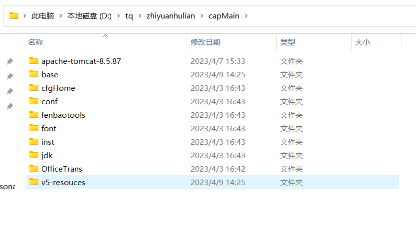
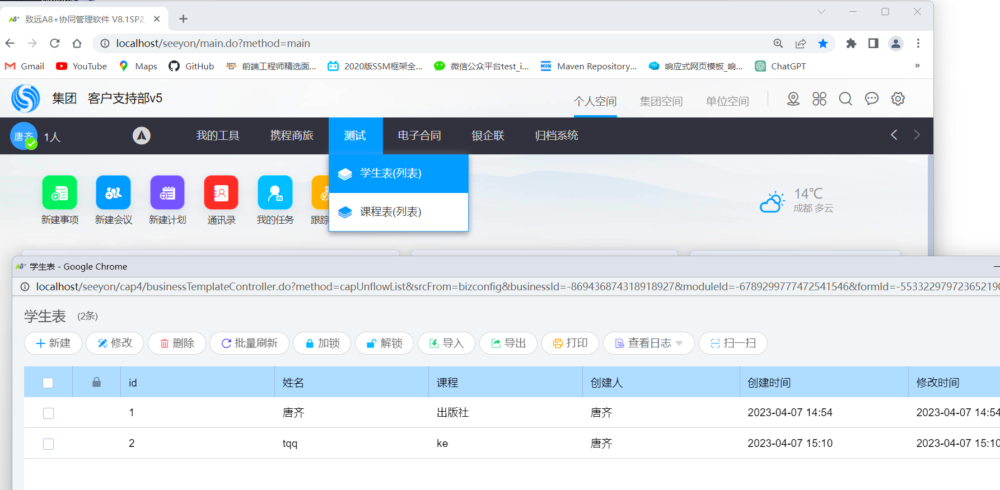
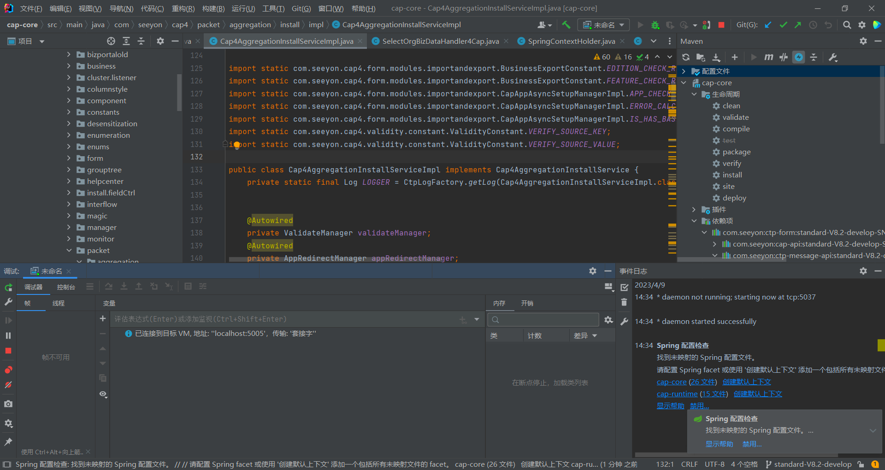
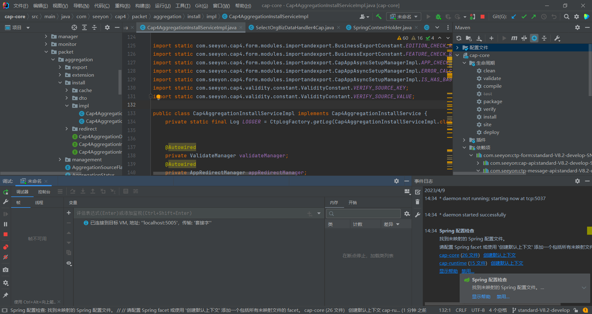
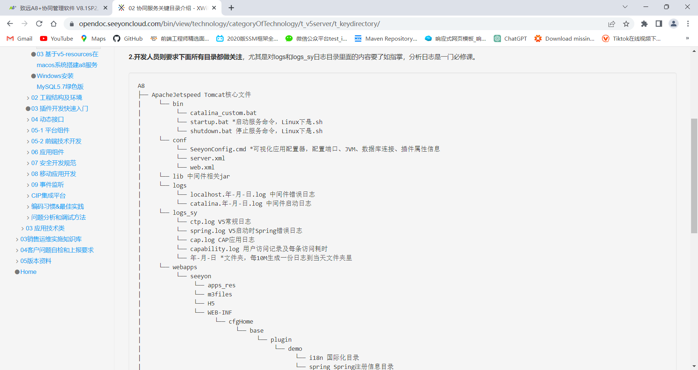
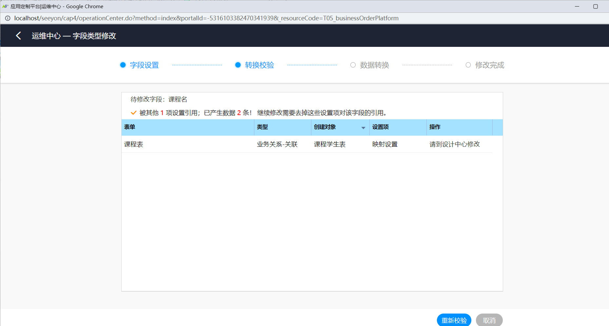

# 致远互联第一周

## 这周完成

- 环境搭建良好，通过薛哥发的资料包进行了配置。

  

- 简单搭建了学分管理系统（利用的cap）

  

- 配好了调试的环境，以及熟悉了表单设计，以及整个业务的大概。

  

- 学会了单步调试

  

- 熟悉了业务包的目录结构以及作用

  

## 这周问题

- 目前无法用IDEA进行本地运行调试，似乎是加载不出来，但是可以远程进行调试。
- 对于具体的细致业务逻辑还不够熟悉，例如：表单明细表如何关联，各个表在实际场景中的作用，以及表的设计应该遵循什么规则。
- 文档略粗糙，理解需要花费一定时间。
- 主表和明细表之间如何关联，明细表在主表中是什么字段还是一种从表类型，
- 反向配置表单规则，有无案例视频和详细文档讲解。
- 表单设计和应用管理详细文档

## 下周准备

- 配置检查规则

  （需要先熟悉业务逻辑）

  

- 能够反向配置表单来然后用校验规则来校验

  （需要先熟悉业务逻辑）（和详细文档资料）

- 3~5个BUG的修改 或者能开发简单应用如开发2个规则

  